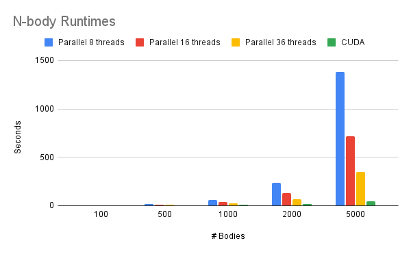

# N-Body Simulation using CUDA and OpenMP
Simulates the gravitational interaction between multiple bodies in a 3D space with C++ using CUDA and OpenMP for parallelization. Project as part of the Parallel Computing graduate course at UNC Charlotte. Executed on the university's Centaurus Cluster. 

For each frame, every body has to calculate the influece it receives from every other body on its direction and velocity. Parallelizing this leads to significant performance increases.

Code was tested with 100, 500, 1000, 2000, and 5000 bodies. The program outputs a csv file of the positions of each body at every timestep. This is then input to a python script to produce the visualization shown below.

There are three folders, "Sequential", "Parallel_OpenMP", and "Parallel_CUDA" that contain the different implementations.

Comparison of running the program using OpenMP with different numbers of CPU threads versus running on a GTX-1080ti GPU using CUDA.

The below chart includes the sequential runtimes as well.

